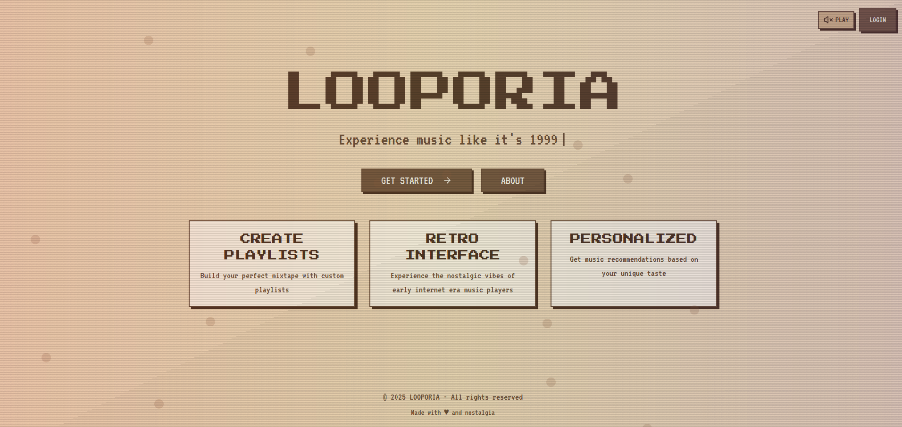

<div align="center">

# Looporia - Retro Music Player




</div>

## Overview

Looporia is a modern web application built with React, TypeScript, and Tailwind CSS that provides a nostalgic music playback experience. The project uses Vite as a build tool and integrates with Supabase for authentication and audio file storage.

## Table of Contents

- [Prerequisites](#prerequisites)
- [Installation](#installation)
- [Tech Stack](#tech_stack)
- [Project Structure](#project-structure)
- [Running the Project](#running-the-project)
- [Features](#features)
- [Development](#development)
- [Building for Production](#building-for-production)
- [Supabase Integration](#supabase-integration)
- [Project Configuration](#project-configuration)
- [Styling](#styling)
- [Testing](#testing)
- [Deployment](#deployment)
- [Contributing](#contributing)
- [License](#license)

## Prerequisites

Before you begin, ensure you have the following installed on your system:

- Node.js (v16 or higher)
- npm (v7 or higher) or Bun
- Git

## Installation

1. Clone the repository:
   ```bash
   git clone https://github.com/username/looporia.git
   cd looporia
   ```

2. Install dependencies:
   ```bash
   npm install
   # or if you prefer Bun
   bun install
   ```

3. Set up environment variables:
   Create a `.env` file in the root directory:
   ```
   SUPABASE_URL=your-supabase-url
   SUPABASE_ANON_KEY=your-supabase-anon-key
   ```

## Tech Stack
### Frontend Framework

- React 18 with TypeScript for type-safe component development
- Vite as our blazing-fast build tool and development server
- React Router for seamless client-side navigation

### Styling & UI

- Tailwind CSS for utility-first styling with custom retro-themed extensions
- shadcn/ui component library providing accessible, customizable UI components

### Backend & Storage

Supabase as our backend-as-a-service platform, providing:

  - Authentication with social provider integration
  - PostgreSQL database for user data and music metadata
  - Storage buckets for audio files and album artwork
  - Real-time subscriptions for collaborative features

## Project Structure

```
├── node_modules/           # Project dependencies
├── public/                 # Static assets
│   ├── audio/              # Audio files
│   │   └── Adele - Skyfall.opus  # Sample audio track
│   ├── favicon.ico         # Website favicon
│   ├── placeholder.svg     # Placeholder image
│   └── robots.txt          # Robots control file
├── src/                    # Source code
│   ├── api/                # API services
│   │   ├── audioService.d.ts  # Audio service type definitions
│   │   └── audioService.js    # Audio service implementation
│   ├── components/         # React components
│   │   ├── ui/             # UI components (shadcn/ui)
│   │   │   └── [...]       # Various UI components
│   │   ├── AuthGuard.tsx   # Authentication guard component
│   │   ├── MusicPlayerMini.tsx  # Mini music player component
│   │   ├── RetroMusicPlayer.tsx # Main music player component
│   │   └── TrackList.tsx   # Track listing component
│   ├── contexts/           # React contexts
│   │   └── AuthContext.tsx # Authentication context
│   ├── hooks/              # Custom React hooks
│   │   ├── use-mobile.tsx  # Mobile detection hook
│   │   └── use-toast.ts    # Toast notification hook
│   ├── integrations/       # Third-party integrations
│   │   └── supabase/       # Supabase integration
│   │       ├── client.ts   # Supabase client
│   │       └── types.ts    # Supabase type definitions
│   ├── lib/                # Utility libraries
│   │   └── utils.ts        # Utility functions
│   ├── pages/              # Page components
│   │   ├── About.tsx       # About page
│   │   ├── AudioUploadTest.tsx # Audio upload testing page
│   │   ├── Auth.tsx        # Authentication page
│   │   ├── Dashboard.tsx   # User dashboard
│   │   ├── Index.tsx       # Main index page
│   │   ├── Landing.tsx     # Landing page
│   │   ├── MusicExploration.tsx # Music exploration page
│   │   └── NotFound.tsx    # 404 page
│   ├── App.css             # App-specific styles
│   ├── App.tsx             # Main application component
│   ├── index.css           # Global styles
│   ├── main.tsx            # Application entry point
│   └── vite-env.d.ts       # Vite environment types
├── supabase/               # Supabase configurations
│   └── config.toml         # Supabase configuration
├── .gitignore              # Git ignore file
├── bun.lockb               # Bun lockfile
├── components.json         # shadcn/ui components configuration
├── eslint.config.js        # ESLint configuration
├── index.html              # HTML entry point
├── package.json            # Project dependencies and scripts
├── package-lock.json       # npm lockfile
├── postcss.config.js       # PostCSS configuration
├── README.md               # Project documentation
├── tailwind.config.ts      # Tailwind CSS configuration
├── tsconfig.json           # TypeScript configuration
├── tsconfig.app.json       # TypeScript app-specific configuration
├── tsconfig.node.json      # TypeScript Node.js configuration
└── vite.config.ts          # Vite configuration
```

## Running the Project

To start the development server:

```bash
npm run dev
# or with Bun
bun run dev
```

This will start the development server at `http://localhost:5173` (default Vite port).

## Features

- **Retro Music Player Interface**: Nostalgic design inspired by classic music players
- **Audio Playback**: Play, pause, skip, and control volume of audio tracks
- **Mini Player Mode**: Compact player that stays visible while browsing
- **User Authentication**: Secure login and registration via Supabase
- **Track Listing**: Browse and filter your music collection
- **Responsive Design**: Works on desktop and mobile devices
- **Audio Upload**: Upload your own audio files (requires authentication)

## Development

### Code Organization

- Place new React components in the `src/components` directory
- Pages or views should go in the `src/pages` directory
- Reusable hooks belong in the `src/hooks` directory
- API services should be added to the `src/api` directory

### UI Components

This project uses the shadcn/ui component library, which provides a set of accessible, customizable UI components built on Radix UI and styled with Tailwind CSS. Components are located in `src/components/ui`.

To add a new shadcn/ui component:

```bash
npx shadcn-ui add [component-name]
```

### Authentication

The project uses Supabase Authentication. The authentication flow is handled by the `AuthContext` and `AuthGuard` components. To access protected routes, users must be authenticated.

## Building for Production

To build the application for production:

```bash
npm run build
# or with Bun
bun run build
```

This will generate optimized production files in the `dist` directory.

To preview the production build locally:

```bash
npm run preview
# or with Bun
bun run preview
```

## Supabase Integration

This project uses Supabase for authentication, database, and storage services.

### Setting Up Supabase

1. Create a Supabase project at [supabase.com](https://supabase.com)
2. Copy your project URL and anon key to your `.env` file
3. Set up the following tables in your Supabase database:
   - users (created automatically)
   - tracks (custom table for music metadata)

### Storage Configuration

Create the following buckets in Supabase storage:
- `audio` - For storing audio files
- `album-art` - For storing album artwork

### Database Schema

#### Tracks Table
```sql
create table tracks (
  id uuid default uuid_generate_v4() primary key,
  title text not null,
  artist text,
  album text,
  duration integer,
  url text not null,
  cover_url text,
  user_id uuid references auth.users(id),
  created_at timestamp with time zone default now()
);

-- Enable RLS
alter table tracks enable row level security;

-- Add policies
create policy "Users can view their own tracks"
on tracks for select
using (auth.uid() = user_id);

create policy "Users can insert their own tracks"
on tracks for insert
with check (auth.uid() = user_id);
```

## Project Configuration

### Tailwind CSS

Tailwind CSS is configured in `tailwind.config.ts`. The configuration includes custom theme settings for the retro music player interface.

### TypeScript

TypeScript configuration is split across three files:
- `tsconfig.json`: Base configuration
- `tsconfig.app.json`: Application-specific settings
- `tsconfig.node.json`: Node.js specific settings

### ESLint

ESLint is configured in `eslint.config.js` using the new flat config format.

## Styling

This project uses Tailwind CSS for styling with additional custom styles in `src/App.css` and `src/index.css`.

The UI components are based on shadcn/ui, a collection of reusable components built with Radix UI and Tailwind CSS.

## Testing

To run tests:

```bash
npm run test
```

For end-to-end testing:

```bash
npm run test:e2e
```

## Deployment

### Building for Production

```bash
npm run build
```

### Deployment Platforms

The application can be deployed to various platforms:

- Vercel
- Netlify
- AWS Amplify
- GitHub Pages

#### Deploying to Vercel

1. Connect your GitHub repository to Vercel
2. Set the following environment variables:
   - `VITE_SUPABASE_URL`
   - `VITE_SUPABASE_ANON_KEY`
3. Deploy the application

## Contributing

1. Fork the repository
2. Create a feature branch: `git checkout -b feature/your-feature-name`
3. Commit your changes: `git commit -m 'Add some feature'`
4. Push to the branch: `git push origin feature/your-feature-name`
5. Open a Pull Request

## License

This project is licensed under the [MIT License](LICENSE).
